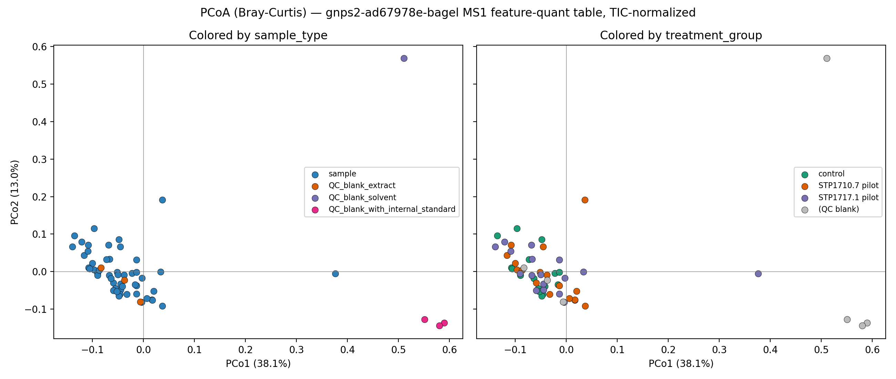
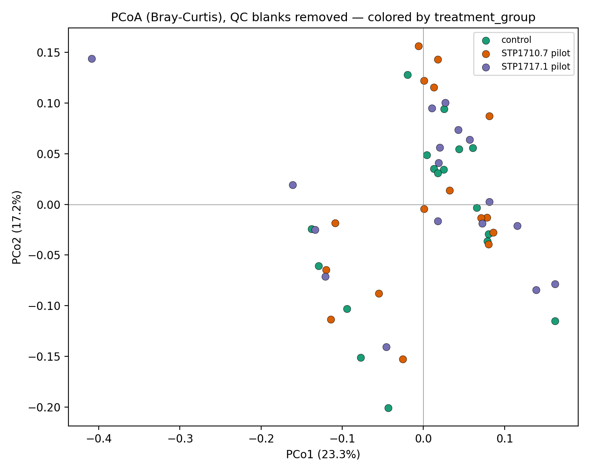
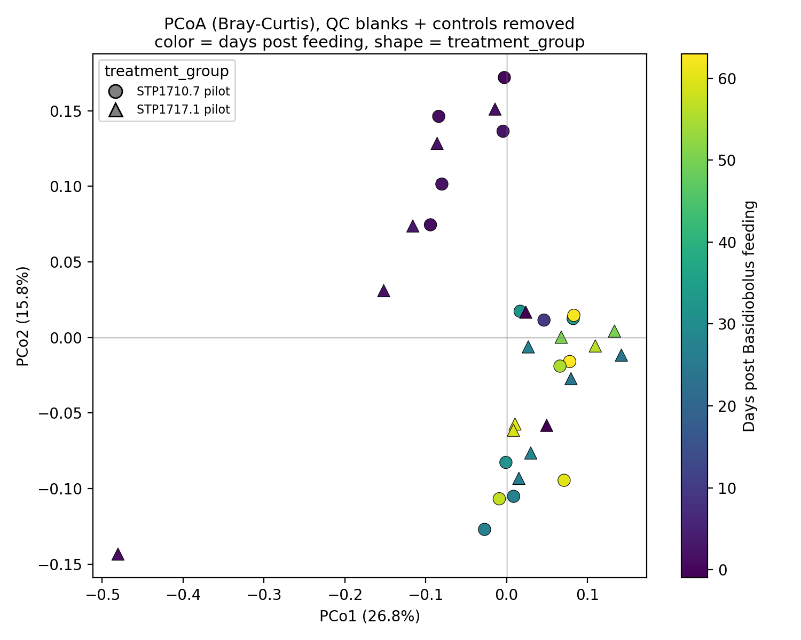

# PCoA MS Feature Composition

## Purpose

How do the 57 MS1 feature-quant samples (50 biological wood-frog fecal
samples + 7 QC blanks) from the `gnps2-ad67978e-bagel` bundle lay out in
ordination space, and does that layout separate by `sample_type` (QC vs.
biological), by feeding-experiment `treatment_group`, or by sample age
(derived from the metadata's animal-timeline dates — see below)?

## Status

**Status**: complete

## Datasets

- `gnps2-ad67978e-bagel` (`data/DATA_MANIFEST.md`) — primary feature-quant
  table (`aligned_features.csv.gz`, 12,566 features x 57 samples' peak-area
  columns) and enriched sample metadata (`merged_metadata.tsv`).

## Algorithms

No entry yet in `algorithms/ALGORITHM_MANIFEST.md` — this analysis uses a
short, self-contained classical (Gower) PCoA implementation and a
permutation-based PERMANOVA (Anderson 2001 pseudo-F), both in
`scripts/01_pcoa.py`, rather than a registered reusable algorithm module.

## Method

1. Load the MS1 (non-MS1-suffixed, i.e. MS2-file-associated) peak-area
   columns from `aligned_features.csv.gz`, matched to
   `merged_metadata.tsv` by `filename`.
2. Fill NaN peak areas with 0 (README_FOR_CLAUDE.md: NaN in this gap-filled
   export means "not detected," not "missing measurement").
3. TIC-normalize each sample (divide by that sample's total peak area
   across all 12,566 features), per the bundle README's cross-sample
   guidance.
4. Compute a Bray-Curtis distance matrix across the 57 samples and run
   classical (Gower-centered eigendecomposition) PCoA.
5. Test group separation with a permutation PERMANOVA (999 permutations,
   seed 42): once for `sample_type` (all 57 samples) and once for
   `treatment_group` restricted to the 50 biological samples (QC blanks
   excluded — they have no treatment_group).
6. A second ordination re-runs classical PCoA on the Bray-Curtis submatrix
   for the 50 biological samples only (QC blanks removed before the
   Gower centering step, not just hidden from the plot — dropping the
   blanks changes the centroid the other 50 samples are centered against,
   so this is a distinct PCoA, not a crop of the first one).
7. **Sample age is derived, not directly recorded**, from three per-animal
   timeline dates already in `merged_metadata.tsv` (`collection_date`,
   `metamorphosis_date`, `basidiobolus_feeding_date`; `subject_id` groups
   repeat samples per animal — 19 subjects, mostly 3 timepoints each):
   `days_post_metamorphosis = collection_date - metamorphosis_date`
   (developmental age) and `days_post_feeding = collection_date -
   basidiobolus_feeding_date` (experimental time since fungal exposure).
   Both are complete (no missing values) for all 50 biological samples;
   two samples have `days_post_feeding = -1` (collected the day *before*
   feeding — legitimate pre-exposure baseline timepoints, not an error).
8. A third ordination re-runs classical PCoA again, this time on QC
   blanks *and* `control`-treatment samples removed (n=33, the two
   Basidiobolus-fed pilot cohorts only) — `days_post_feeding` isn't a
   meaningful clock for unfed controls, so they're dropped rather than
   colored by an undefined value. Plotted with color = `days_post_feeding`
   (continuous) and marker shape = `treatment_group`. Spearman correlation
   between `days_post_feeding` and each of PC1/PC2 backs the visual
   gradient with a statistic.

## Ordination Plots

**All 57 samples**, colored by `sample_type` (left) and by `treatment_group`
(right):



**QC blanks removed** (50 biological samples only, PCoA re-run on that
subset), colored by `treatment_group`:



**QC blanks and controls removed** (33 Basidiobolus-fed samples only, PCoA
re-run on that subset), color = `days_post_feeding` (derived age/timeline
gradient), shape = `treatment_group` (pilot cohort):



## Key Findings

- **PC1 explains 38.1% of variance, PC2 13.0%** (15 of 57 eigenvalues were
  negative, expected for a non-Euclidean Bray-Curtis distance; % variance
  is computed over positive eigenvalues only).
- **`sample_type` separates strongly and significantly**: QC blanks (solvent
  blank, blank-with-internal-standard) sit far out along PC1/PC2 from the
  biological-sample cluster; PERMANOVA pseudo-F = 16.39, p = 0.001
  (999 permutations). This is the expected/sanity-check result — it shows
  the ordination and normalization are behaving reasonably (blanks should
  look chemically distinct from fecal extracts).
- **`treatment_group` (control / STP1710.7 pilot / STP1717.1 pilot) does
  NOT separate** among the 50 biological samples: PERMANOVA pseudo-F =
  0.93, p = 0.543. Visually the three treatment groups are fully
  intermixed within the biological-sample cluster in both panels of
  `outputs/pcoa_bray_curtis.pdf`.
- One biological sample is a clear outlier (PCo1 ≈ 0.38, far from the main
  sample cluster) and one `QC_blank_extract` sits closer to the biological
  cluster than the other blanks — worth a closer look (see Open Questions)
  before treating either as routine.
- **With QC blanks removed and PCoA re-run on the 50 biological samples**,
  PC1/PC2 explain less variance each (23.3% / 17.2%, vs. 38.1% / 13.0% with
  blanks included — removing the blanks' large between-group variance
  redistributes explained variance across more axes). Treatment groups
  still do not visually separate; this is consistent with (not an
  independent confirmation beyond) the PERMANOVA result above, since the
  PERMANOVA on `treatment_group` was already blank-excluded.
- **`days_post_feeding` explains real structure that `treatment_group`
  did not.** Restricted to the 33 Basidiobolus-fed samples (blanks and
  controls removed), PC1 (26.8% variance) and PC2 (15.8%) both correlate
  significantly with days since feeding: Spearman rho = 0.54 with PC1
  (p = 0.0012) and rho = -0.45 with PC2 (p = 0.0093). Visually, the
  earliest timepoints (dark purple, ~0-10 days post-feeding) sit apart
  from the latest (yellow, ~50-63 days) along a diagonal gradient across
  PC1/PC2 — this is a much cleaner separation than either treatment-group
  panel above, and this axis is present in both pilot cohorts (circles
  and triangles both span the same color gradient, not stratified by
  shape). **Sample age since feeding, not treatment arm, looks like the
  dominant biological axis of variation in this feature table.**

## Open Questions

- Identify the outlier biological sample (PCo1 ≈ 0.38) by `sample_id` in
  `outputs/pcoa_scores.csv` and check whether it's a QC/handling issue or a
  genuine biological outlier.
- The one `QC_blank_extract` that lands near the biological-sample cluster
  (rather than with the other blanks) may indicate carryover/contamination
  in that extraction blank — worth flagging to the wet-lab side.
- `treatment_group` and `treatment` columns in `merged_metadata.tsv` are
  identical in this bundle; only `treatment_group` was used here.
- Non-significant treatment-group PERMANOVA here is a global test across
  all 12,566 features — a more targeted test (e.g. restricted to
  library-annotated / diagnostic-ion-confirmed features, per the bundle
  README's annotation guidance) might still reveal a treatment effect
  masked by noise features in the full table. Not attempted in this pass.
- No correction for `tank`/`egg_mass`/collection-date structure — treatment
  groups may be confounded with these design variables; not checked here.
- Given the strong `days_post_feeding` correlation, the earlier
  non-significant `treatment_group` PERMANOVA should be revisited with
  `days_post_feeding` (or `subject_id`, since each animal is sampled
  repeatedly) as a covariate/blocking factor — an effect of treatment
  could be masked by the much larger age/time trend if not accounted for.
  Not attempted in this pass.
- `days_post_metamorphosis` and `days_post_feeding` are highly correlated
  with each other by construction (animals were fed a few days after
  metamorphosis on a similar schedule); this analysis only tested
  `days_post_feeding`. Worth checking whether `days_post_metamorphosis`
  (pure developmental age) explains the ordination equally well, which
  would matter for distinguishing a developmental-age effect from a
  time-since-exposure effect.
- The repeated-measures structure (most of the 19 subjects contribute 3
  timepoints) means the 33 treated-only points are not independent
  observations — the Spearman test above does not account for
  within-subject correlation. A mixed-effects or subject-blocked
  permutation test would be a more rigorous follow-up.

## Reproducibility

To reproduce all outputs:

```bash
cd analysis/pcoa-ms-feature-composition
bash run.sh
```

Requires `pandas`, `numpy`, `scipy`, `matplotlib` (available via the
system `python3` / miniconda env on this host — no project-level pixi
environment exists yet; see `ENVIRONMENTS_INSTALLATIONS.md`).

## Outputs

| File | Description |
|------|-------------|
| `outputs/pcoa_bray_curtis.pdf` / `.png` | Two-panel PCoA ordination (PC1 vs PC2), all 57 samples, colored by `sample_type` and by `treatment_group`. |
| `outputs/pcoa_bray_curtis_no_blanks.pdf` / `.png` | PCoA re-run on the 50 biological samples only (QC blanks removed before ordination), colored by `treatment_group`. |
| `outputs/pcoa_scores.csv` | Per-sample PCo1-5 coordinates (all 57 samples) joined to `sample_id`, `sample_type`, `treatment_group`, `subject_id`. |
| `outputs/pcoa_scores_no_blanks.csv` | Per-sample PCo1-5 coordinates for the blanks-removed ordination (50 biological samples), joined to `sample_id`, `treatment_group`, `subject_id`. |
| `outputs/pcoa_bray_curtis_treated_only_by_age.pdf` / `.png` | PCoA re-run on the 33 Basidiobolus-fed samples only (QC blanks + controls removed), color = `days_post_feeding`, shape = `treatment_group`. |
| `outputs/pcoa_scores_treated_only.csv` | Per-sample PCo1-5 coordinates for the treated-only ordination (33 samples), joined to `sample_id`, `subject_id`, `treatment_group`, `days_post_feeding`, `days_post_metamorphosis`. |
| `outputs/pcoa_variance_explained.csv` | % variance explained per PCoA axis (all-57-sample ordination). |
| `outputs/numbers.json` | Reportable values (sample/feature counts, % variance for all three ordinations, PERMANOVA pseudo-F/p, Spearman rho/p for `days_post_feeding` vs. PC1/PC2) registered via `register_value`. |
